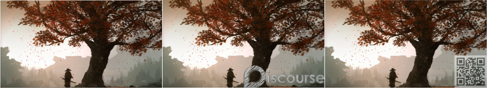
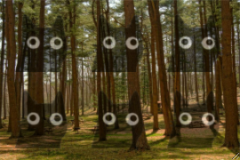
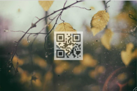
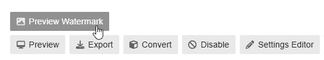
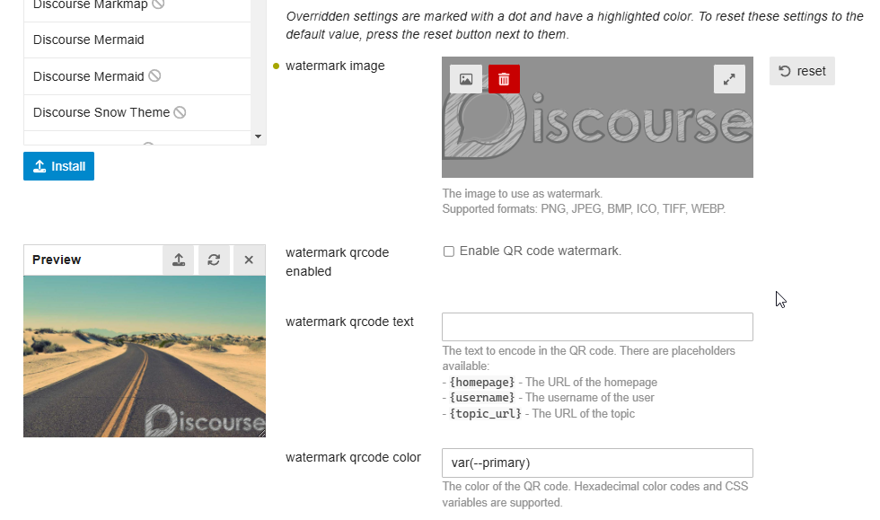
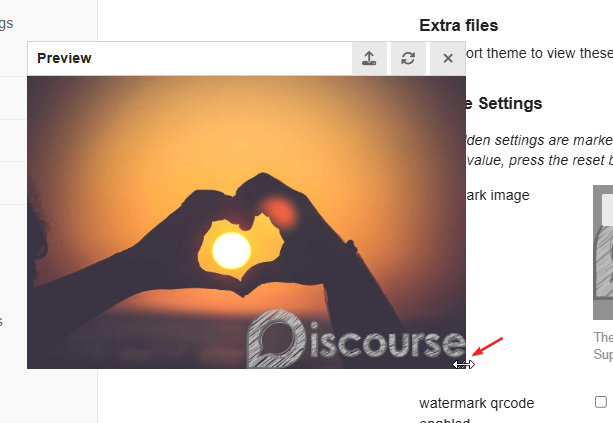
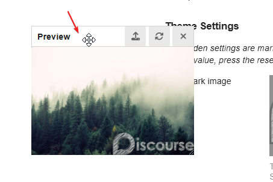

# Watermark Image

## Description

This theme component watermarks images while they are being uploaded from the composer. The watermark can be an image, a generated QR code, or styled text, with full control over size, placement, appearance, and repetition patterns.

Watermarking can be applied site-wide, or restricted to specific categories, groups, and tags. Watermark profiles let different parts of your community use different watermark setups. Members of chosen groups can also switch the watermark on or off per image directly in the composer.

_Please review the Important Notes section before enabling this on a live site._

## Features

- High-performance processing using [WebAssembly](https://developer.mozilla.org/en-US/docs/WebAssembly) and [Web Workers](https://developer.mozilla.org/en-US/docs/Web/API/Web_Workers_API/Using_web_workers)
- Comprehensive image format support (PNG, JPEG, BMP, ICO, TIFF, WEBP)
- Three watermark sources: image, QR code, text
- QR code styling: shape/frame/pattern presets, embedded logos, halftone image backdrops
- Text watermarks with font, color/gradient, outline, shadow, and background box
- Flexible sizing (relative or absolute) and nine anchor positions
- Appearance controls: opacity, rotation, scale, margins, blend modes
- Pattern distribution: single, grid, diagonal, random
- Watermark profiles: different configurations per category, group, or tag
- Automatic re-watermarking when the composer's category or tags change after upload
- Manual per-image toggle in the composer for selected groups
- Live preview in the settings panel

## How it works

1. A user adds an image in the composer.
2. The component looks for a matching **profile** (see the Profiles section). Profiles are checked in order, and the first enabled one whose conditions match wins.
3. If no profile matches and the **default watermark** is enabled, the default watermark settings are used, provided their own category/group/tag conditions match.
4. Otherwise the image is uploaded untouched.

> If the user later changes the composer's category or tags, images already uploaded in that composer session are re-evaluated and re-uploaded with the correct watermark (or without one).

## Settings

The settings page is split into two parts, matching the admin UI.

### Global settings

These apply regardless of profiles or the default watermark.

| Setting                       | Description                                                                                                                                         |
| ----------------------------- | --------------------------------------------------------------------------------------------------------------------------------------------------- |
| `profiles`                    | List of watermark profiles. Edited through the objects setting editor. See the Profiles section. Default: `[]`                                   |
| `manual_toggle_groups`        | Groups whose members get a per-image watermark on/off button in the composer. See the Manual toggle section. Default: `""` (nobody)              |
| `skip_small_images`           | Skip watermarking when the image is smaller than `min_image_dimensions`. Default: `false`                                                        |
| `min_image_dimensions`        | Minimum dimensions required to apply a watermark (width x height). Only shown when `skip_small_images` is on. Default: `"200x200"`               |
| `allow_non_supported_uploads` | Allow image uploads to continue when the format is not supported by the watermark library. When off, such uploads are rejected. Default: `false` |
| `allow_upload_on_error`       | Allow the upload to continue if watermarking fails unexpectedly. When off, the upload is blocked and an error is shown. Default: `true`          |

### Default watermark

Used when no profile matches. `default_enabled` turns it on; the remaining settings are grouped in tabs in the admin UI.

| Setting           | Description                                                                                                    |
| ----------------- | -------------------------------------------------------------------------------------------------------------- |
| `default_enabled` | Apply the default watermark, using the settings below, when no profile matches the upload. Default: `false` |

#### Content

| Setting                   | Description                                                                                                                                                                                                                                                                                                                                                                                                                                                                         |
| ------------------------- | ----------------------------------------------------------------------------------------------------------------------------------------------------------------------------------------------------------------------------------------------------------------------------------------------------------------------------------------------------------------------------------------------------------------------------------------------------------------------------------- |
| `source`                  | Watermark source: `image`, `qrcode`, `text` Default: `"image"`                                                                                                                                                                                                                                                                                                                                                                                                                   |
| `image`                   | The image to use as watermark. Supported formats: PNG, JPEG, BMP, ICO, TIFF, WEBP. Default: `""`                                                                                                                                                                                                                                                                                                                                                                              |
| `qrcode_text`             | Text to encode in the QR code. Supports placeholders (see Watermark Types). Default: `""`                                                                                                                                                                                                                                                                                                                                                                                        |
| `qrcode_color`            | QR code color (hex or CSS variable) Default: `"#000000"`                                                                                                                                                                                                                                                                                                                                                                                                                         |
| `qrcode_background_color` | QR code background color (hex or CSS variable) Default: `"#ffffff"`                                                                                                                                                                                                                                                                                                                                                                                                              |
| `qrcode_quiet_zone`       | Width of the blank border around the QR code (0-10 modules) Default: `2`                                                                                                                                                                                                                                                                                                                                                                                                         |
| `qrcode_error_correction` | Error correction level: `Low` (~7%), `Medium` (~15%), `Quarter` (~25%), `High` (~30%). See <a href="https://www.qrcode.com/en/about/error_correction.html" target="_blank">qrcode.com</a>. Default: `"Medium"`                                                                                                                                                                                                                                                                   |
| `qrcode_style_config`     | Module shape, frame, and pattern preset for the QR code. Edited through a visual picker. Default: basic square modules, no frame                                                                                                                                                                                                                                                                                                                                                 |
| `qrcode_halftone_image`   | Optional image rendered as a halftone backdrop behind the QR modules. Default: `""`                                                                                                                                                                                                                                                                                                                                                                                              |
| `qrcode_logo_config`      | Embedded logo options (enabled, source, size, padding). Edited through a visual picker. Default: disabled                                                                                                                                                                                                                                                                                                                                                                        |
| `qrcode_logo_image`       | Image to embed in the center of the QR code when the logo is enabled. Default: `""`                                                                                                                                                                                                                                                                                                                                                                                              |
| `text`                    | The text to draw as the watermark. Supports multiple lines and placeholders. Default: `""`                                                                                                                                                                                                                                                                                                                                                                                       |
| `text_style`              | Font, weight (`normal`/`bold`), italic, case (`none`/`uppercase`/`lowercase`), letter spacing, multi-line alignment (`left`/`center`/`right`), color (solid or gradient), outline, shadow, and background box. Outline and shadow width/blur are 0-20% of the font size. Text direction (LTR/RTL) is detected from the content. Font can be the site font, heading font, monospace font, or any font from Discourse's font catalog. Default: white fill, black outline, centered |

#### Appearance

| Setting          | Description                                                                                                                                                                                                                           |
| ---------------- | ------------------------------------------------------------------------------------------------------------------------------------------------------------------------------------------------------------------------------------- |
| `opacity`        | Watermark opacity. Range: 1-100 Default: `100`                                                                                                                                                                                     |
| `blend_mode`     | How the watermark blends with the image: `normal`, `overlay`, `over`, `atop`, `xor`, `plus`, `multiply`, `burn`, `difference`, `soft_light`, `screen`, `hard_light`, `dodge`, `exclusion`, `lighten`, `darken` Default: `"normal"` |
| `size_mode`      | How the watermark size is calculated: - `relative`: size is relative to the target image width. - `absolute`: applied at its original size. Default: `"relative"`                                                            |
| `relative_width` | Width of the watermark relative to the target image width (in %). Only used in `relative` mode. Range: 1-100 Default: `10`                                                                                                         |
| `absolute_scale` | Scale factor applied to the original watermark size. Only used in `absolute` mode. Min: 0.01 Default: `1`                                                                                                                          |
| `max_size`       | Maximum watermark size as a percentage of the image dimensions. Range: 1-100 Default: `100`                                                                                                                                        |

#### Placement

| Setting                 | Description                                                                                                                                                                  |
| ----------------------- | ---------------------------------------------------------------------------------------------------------------------------------------------------------------------------- |
| `position`              | Anchor position: `top-left`, `top-center`, `top-right`, `center-left`, `center`, `center-right`, `bottom-left`, `bottom-center`, `bottom-right` Default: `"bottom-right"` |
| `margin_x`              | Horizontal margin from the edge (in % of the target image) Default: `0`                                                                                                   |
| `margin_y`              | Vertical margin from the edge (in % of the target image) Default: `0`                                                                                                     |
| `rotate`                | Rotation angle. Range: -360 to 360 degrees Default: `0`                                                                                                                   |
| `pattern`               | Repetition pattern: `single`, `grid`, `diagonal`, `random` Default: `"single"`                                                                                            |
| `pattern_allow_partial` | Allow partial watermarks at image edges Default: `true`                                                                                                                   |
| `pattern_max_count`     | Maximum number of repetitions (0 for unlimited) Default: `50`                                                                                                             |
| `pattern_spacing`       | Spacing between repeated watermarks (in % of the target image) Default: `15`                                                                                              |

#### Conditions

All three must match for the default watermark to apply. Empty `categories` or `tags` mean "no restriction". Empty `groups` means nobody, so at least one group (for example `logged_in_users`) is required.

| Setting      | Description                                                         |
| ------------ | ------------------------------------------------------------------- |
| `categories` | Categories where the default watermark is applied. Default: `""` |
| `groups`     | Groups whose uploads get the default watermark. Default: `"5"`   |
| `tags`       | Tags for which the default watermark is applied. Default: `""`   |

## Profiles

A profile is a complete watermark configuration (source, styling, placement) plus its own conditions (categories, groups, tags). Profiles let different parts of your community use different watermarks instead of a single site-wide one.

Each profile has:

- `name` and `enabled`
- Conditions: `categories`, `groups`, `tags`. Empty `categories` or `tags` match anything. Empty `groups` matches nobody. New profiles start with `logged_in_users`.
- The same content, appearance, and placement fields as the default watermark

Evaluation order:

1. Profiles are checked top to bottom. The first enabled profile whose conditions match the upload is used.
2. If none matches, the default watermark is used when `default_enabled` is on and its own conditions match.
3. Otherwise the image is uploaded without a watermark.

## Watermark Types

### Image

Supported formats: PNG, JPEG, BMP, ICO, TIFF, and WEBP. See the FAQ for why formats are limited.

### QR Code

The encoded text supports these placeholders:

- `{homepage}` - URL of the site
- `{sitename}` - Site title
- `{username}` - Username of the uploader
- `{topic_url}` - URL of the topic being replied to (falls back to the site URL for new topics)

QR codes can be styled beyond a plain black-and-white square:

- Module shape, frame, and pattern presets (dots, rounded modules, frame borders with optional labels, etc.)
- An embedded logo (uploaded image or icon) placed in the center of the code
- A halftone backdrop generated from an uploaded image

**Important:** When styling QR codes, keep contrast and size readable. Heavy styling, low contrast, or a large logo can make the code unscannable. Test with several scanning apps before deploying.

### Text

Draws one or more lines of text. The same placeholders as QR codes are supported. Text direction is detected automatically.

## Composer behavior

### Re-watermarking on category or tag change

Profiles and the default watermark match on the composer's category and tags. If the user picks a category or adds tags **after** uploading images, the component re-evaluates every image uploaded in that composer session, re-runs the watermark pipeline on the original file kept in memory, and replaces the upload. Images that no longer match are re-uploaded without a watermark.

> Note: This only covers images uploaded in the current composer session. Images pasted from a previous draft or session cannot be re-processed because their original file is no longer available.

### Manual toggle

Members of `manual_toggle_groups` opt in per image: their uploads are not watermarked, and each image gets a watermark button in the composer preview (and in the rich text editor). Clicking it applies the matching profile to that image, clicking again removes it. Category and tag changes never re-watermark their images.

> Note: Images uploaded in a previous session show the button as unavailable, for the same reason as above.

### Choosing between profiles

When two or more profiles match an upload, the button opens a menu instead of toggling. It lists every matching profile in admin order, "No watermark", and "Apply to all images". Picking a profile watermarks that image with it. A picked profile stays until the poster changes it, or until a category or tag change makes it stop matching, in which case the watermark is removed again.

## Real-Time Preview

The settings page includes a live preview showing how the current configuration renders on a sample image. The preview window offers:

- Resizable and movable preview window
- Option to load a random sample image
- Support for uploading your own test images from your device

On desktop it opens automatically. It can also be toggled from the button next to the settings tabs:

More images

## ⚠️ Important Notes

- **Original images are not preserved**  
   The server only ever receives the watermarked file. Test your settings thoroughly before enabling this on a live site.
- **Client-side processing**  
   Watermarking runs in the uploader's browser. Very large images or slow devices will make uploads take longer. On mobile, images are processed one at a time.

## FAQ

**Why are image formats limited?**

_While Discourse converts all uploads to JPEG, this component watermarks the original file before upload, using specific image processing libraries. Post-upload watermarking is possible but would require extra upload/download cycles and change the composer experience. Improvements to this workflow are still being explored._

**Can users bypass the watermark?**

_The watermark is applied in the browser, so a technically inclined user can disable it. Treat this as a convenience and attribution tool, not as a security measure._

## Roadmap

Future development plans may include:

- <s>Multiple watermark profiles</s> (now supported!
- <s>Post-upload watermarking</s> (now supported!)
- Original image preservation [^1]

[^1]: May require plugin development.

## Credits

This theme component is powered by:

- [Photon](https://silvia-odwyer.github.io/photon/): A WebAssembly image processing library
- [QR Code Generator](https://www.nayuki.io/page/qr-code-generator-library): Modified [fork](https://github.com/Arkshine/qr-code-generator-wasm) with WebAssembly support.
