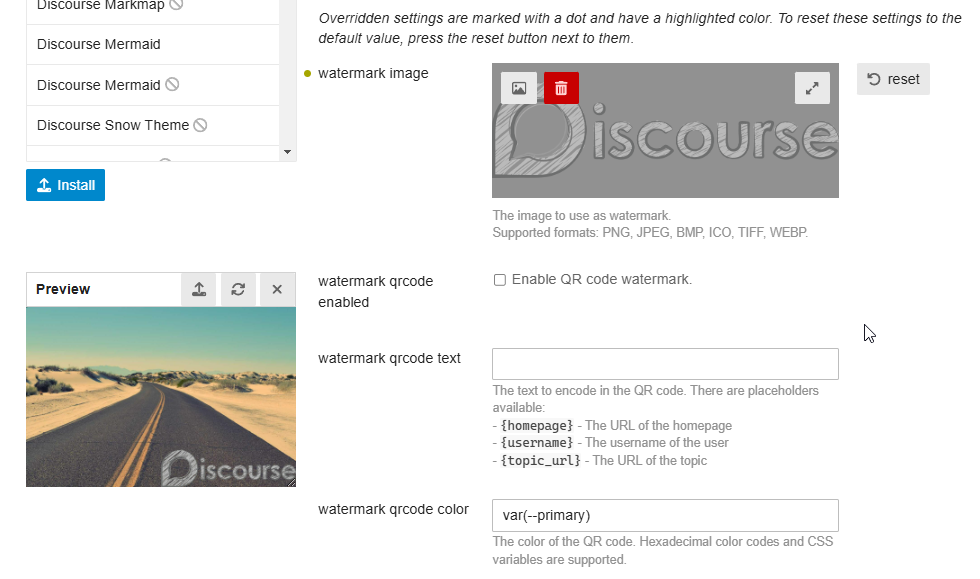

# Watermark Image

## Description

This theme component automatically adds watermarks to user-uploaded images. You can use either an image or a QR code as your watermark, with extensive customization options for position, appearance, and distribution patterns.

The component offers granular control through category and user group settings, allowing you to tailor the watermarking behavior to your community's needs.

_Please review the Important Notes section before implementation._

## Features

- High-performance processing using [WebAssembly](https://developer.mozilla.org/en-US/docs/WebAssembly) and [Web Workers](https://developer.mozilla.org/en-US/docs/Web/API/Web_Workers_API/Using_web_workers)
- Comprehensive image format support (PNG, JPEG, BMP, ICO, TIFF, WEBP)
- Dynamic QR code watermark generation
- Flexible sizing options (relative or absolute)
- Versatile positioning system
- Advanced appearance customization (opacity, rotation, scale, margin, etc.)
- Multiple blending modes
- Pattern distribution options (single, grid, diagonal, random)
- Category and user group-specific settings
- Live preview in settings panel

## Settings

| Setting                       | Description                                                                                                                                                                                                                                                           |
| ----------------------------- | --------------------------------------------------------------------------------------------------------------------------------------------------------------------------------------------------------------------------------------------------------------------- |
| `image`                       | The image to use as watermark.  Supported formats: PNG, JPEG, BMP, ICO, TIFF, WEBP. Default: `""`                                                                                                                                                               |
| `size_mode`                   | How the watermark size is calculated: - `relative`: Size is relative to the target's image width. - `absolute`: Applied at its original size. Default: `"relative"`                                                                                          |
| `relative_width`              | The width of the watermark relative to the target image width (in %). Only applies when the watermark size mode is set to `relative`.  Range: 1-100 Default: `10`                                                                                            |
| `absolute_scale`              | Scale factor for original watermark size (only used in absolute mode). Min: 0.01 Default: `1`                                                                                                                                                                      |
| `max_size`                    | Maximum size as percentage of image dimensions. Range: 1-100 Default: `50`                                                                                                                                                                                         |
| `position`                    | Position of the watermark: `top-left`, `top-center`, `top-right`, `center-left`, `center`, `center-right`, `bottom-left`, `bottom-center`, `bottom-right` Default: `"bottom-right"`                                                                                |
| `margin_x`                    | Horizontal margin from the edge (in % of the target image) Default: `0`                                                                                                                                                                                            |
| `margin_y`                    | Vertical margin from the edge (in % of the target image) Default: `0`                                                                                                                                                                                              |
| `opacity`                     | Watermark opacity. Range: 1-100 Default: `100`                                                                                                                                                                                                                     |
| `rotate`                      | Rotation angle.  Range: -360 to 360 degrees Default: `0`                                                                                                                                                                                                        |
| `blend_mode`                  | How the watermark blends with the image: `normal`, `overlay`, `over`, `atop`, `xor`, `plus`, `multiply`, `burn`, `difference`, `soft_light`, `screen`, `hard_light`, `dodge`, `exclusion`, `lighten`, `darken` Default: `"normal"`                                 |
| `pattern`                     | Watermark repetition pattern: `single`, `grid`, `diagonal`, `random` Default: `"single"`                                                                                                                                                                           |
| `pattern_allow_partial`       | Allow partial watermarks at image edges Default: `true`                                                                                                                                                                                                            |
| `pattern_max_count`           | Maximum number of watermark repetitions (0 for infinite) Default: `50`                                                                                                                                                                                             |
| `pattern_spacing`             | Spacing between repeated watermarks (in % of the target image) Default: `15`                                                                                                                                                                                       |
| `qrcode_enabled`              | Enable QR code watermark Default: `false`                                                                                                                                                                                                                          |
| `qrcode_text`                 | Text to encode in QR code. Supports placeholders: `{homepage}`, `{username}`, `{topic_url}` Default: `""`                                                                                                                                                          |
| `qrcode_color`                | QR code color (hex or CSS variable) Default: `"var(--primary)"`                                                                                                                                                                                                    |
| `qrcode_background_color`     | QR code background color (hex or CSS variable) Default: `"var(--secondary)"`                                                                                                                                                                                       |
| `qrcode_quiet_zone`           | Width of white space border around QR code (0-10 modules) Default: `2`                                                                                                                                                                                             |
| `qrcode_error_correction`     | Error correction level: `Low` (~7%), `Medium` (~15%), `Quarter` (~25%), `High` (~30%) More information about error correction levels can be found <a href="https://www.qrcode.com/en/about/error_correction.html" target="_blank">here.</a> Default: `"Medium"` |
| `categories`                  | Categories where watermark should be applied. Default: `""`                                                                                                                                                                                                        |
| `groups`                      | Groups the watermark should be applied to. Default: `"0"`                                                                                                                                                                                                          |
| `skip_small_images`           | Skip watermarking if image is below `min_image_dimensions`. Default: `false`                                                                                                                                                                                       |
| `min_image_dimensions`        | Minimum dimensions required (width x height) Default: `"200x200"`                                                                                                                                                                                                  |
| `allow_non_supported_uploads` | Allow image uploads to continue even when format is not supported Default: `false`                                                                                                                                                                                 |
|                               |

## Watermark Types

### Image

The component supports multiple image formats: PNG, JPEG, BMP, ICO, TIFF, and WEBP.
See the FAQ section for important information about format support limitations.

### QR Code

Generate dynamic QR codes with customizable content using these variables:

- `{homepage}` - The URL of the homepage
- `{username}` - The username of the user
- `{topic_url}` - The URL of the topic

**Important:** When styling QR code watermarks, be mindful of contrast and sizing. Poor contrast ratios or excessive styling can make QR codes unreadable. Always test your QR code watermarks with multiple scanning apps before deploying to production.

## Real-Time Preview

The settings panel includes a real-time preview feature, allowing you to see how your watermark configuration affects a sample image instantly.
The preview window offers several interactive features:

- Resizable and movable preview window
- Option to load a random sample image
- Support for uploading your own test images from your device

On desktop, it opens automatically. You can also open from the button at the bottom of the page:

More images

## ⚠️ Important Notes

- **Original Images Are Not Preserved**  
   Watermarks are applied before server upload, and original images are not retained. Thoroughly test your watermark settings before deploying to production.

## FAQ

**Why are image formats limited?**

_While Discourse converts all uploads to JPEG, this TC watermarking occurs pre-upload on the original format, using specific image processing libraries. While post-upload watermarking is possible, it would require multiple upload/download cycles and affect the composer experience. I'm still exploring improvements to this workflow._

**Why isn't text watermarking supported?**

_Text watermarking would require extensive configuration options (font selection, styling, etc.) that would be difficult to implement effectively without a dedicated interface. Image watermarks provide more flexibility and can be created using existing design tools._

## Roadmap

Future development plans may include:

- Multiple watermark profiles [^1]
- Original image preservation [^2]
- Post-upload watermarking

[^1]: The upload input is partially supported with the [Object settings type](https://meta.discourse.org/t/objects-type-for-theme-setting/305009) -- it can't be done in a TC at the moment.
[^2]: May require plugin development.

## Credits

This theme component is powered by:

- [Photon](https://silvia-odwyer.github.io/photon/): A WebAssembly image processing library
- [QR Code Generator](https://www.nayuki.io/page/qr-code-generator-library): Modified [fork](https://github.com/Arkshine/qr-code-generator-wasm) with WebAssembly support.
